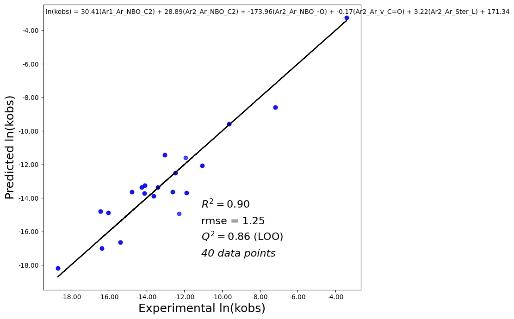

## Example 1: Descriptor Extraction for Azoarene Molecules

**Scenario:**  
You are working on a series of azoarene derivatives and want to automatically extract DFT descriptors (such as frequencies, NBO charges, and orbital energies) from Gaussian log files, to analyze structure–property relationships.

**Code Explanation:**  
- The notebook `azoarene.ipynb` guides you through:
  1. **Uploading log files**: Use Colab’s file upload or mount Google Drive to access your Gaussian calculation logs for different azoarene molecules.
  2. **Descriptor Extraction**: Calls the main extraction pipeline to parse each log file, extracting relevant features such as vibrational frequencies, NBO charges, HOMO-LUMO gap, etc.
     ```python
     from extractor_regr import batch_extract_and_save
     batch_extract_and_save('/content/azoarene_logs/', '/content/azoarene_descriptors.csv')
     ```
     - This function loops over all `.log` files, applies feature extraction, and outputs a comprehensive CSV table.
  3. **Data Inspection**: Shows how to quickly preview the extracted data in pandas, ensuring the results look correct.
  4. **Download Results**: Provides a cell for downloading the result CSV to your local computer for further analysis.

**Typical Output:**  
A descriptor table in CSV format ready for statistical or machine learning analysis.

