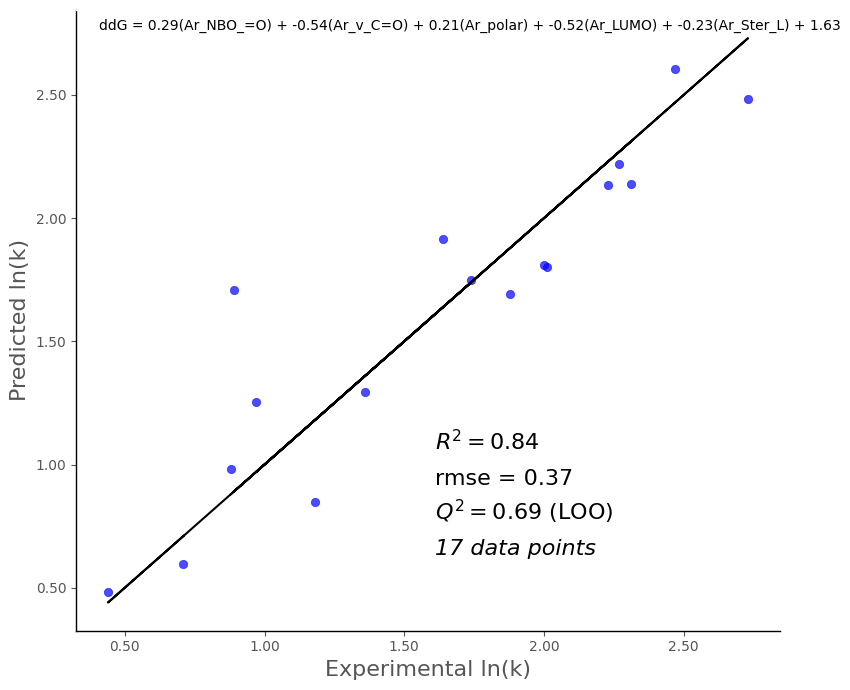

# 🧪 Heck Reaction with Boronic Acids

This example demonstrates how to use `DFTDescriptorPipeline` to predict the activation barrier (ΔΔG, or ln(k)) of Heck reactions involving boronic acids.

## 🚀 Quick Start (Colab)

To run this notebook, open:

👉 [heck_boronic_acids.ipynb](https://github.com/peculab/DFTDescriptorPipeline/blob/main/examples/heck_boronic_acids/heck_boronic_acids.ipynb)  
or launch directly in [Google Colab](https://colab.research.google.com/github/peculab/DFTDescriptorPipeline/blob/main/examples/heck_boronic_acids/heck_boronic_acids.ipynb)

## 🧩 Key Steps

In this example, you will:

1. Install dependencies (`morfeus-ml`)
2. Clone the repository
3. Import modules from `DFTDescriptorPipeline/descriptors`:

```python
import sys
sys.path.insert(0, "/content/DFTDescriptorPipeline/descriptors")

from aggregate import generate_feature_table
from regression import prepare_data, search_best_models
```
## 📊 Sample Output

The regression model shows strong predictive performance:


