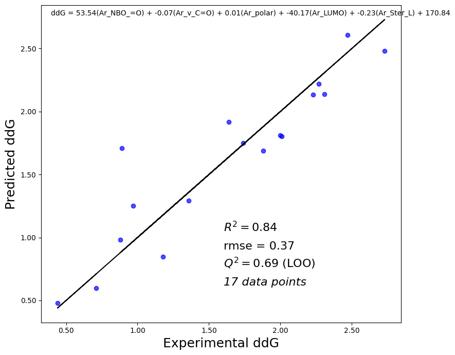

# Quantum Descriptor Regression for Heck & Boronic Acids Reactions 🧪🔬

This repository contains a complete workflow for **extracting quantum chemical descriptors from Gaussian log files** and **predicting reaction kinetics (e.g., `ln(kobs)`)** for Heck coupling and boronic acid-related reactions using machine learning.



It includes:
- `extractor_regr.py`: Core feature extraction and regression module
- `heck_boronic_acids.ipynb`: Jupyter notebook to walk through the full analysis process
- Support for HOMO/LUMO, NBO, dipole, polarizability, Sterimol parameters, and more

---

## 🧠 What This Project Does

- Extracts quantum descriptors from Gaussian `.log` files automatically
- Computes Sterimol descriptors using `morfeus-ml`
- Merges descriptors with structured datasets of Heck/Boronic acid reaction rates
- Searches for the best regression model using LOOCV (Leave-One-Out Cross-Validation)
- Generates plots and Excel outputs for further analysis or publication

## ⚙️ How to Use

### 1. Install requirements

```bash
pip install pandas numpy scikit-learn matplotlib morfeus-ml
````

> `extractor_regr.py` will auto-install `morfeus-ml` if missing.

---

### 2. Prepare your input files

* Gaussian `.log` files → stored in a folder like `logfiles/`
* Excel file (`reactions.xlsx`) with columns like:

  * `Compound`, `Ar1`, `Ar2`, `ln(kobs)` or other kinetic targets

---

### 3. Run the pipeline

#### Option 1: Script (recommended for batch mode)

```python
from extractor_regr import run_full_pipeline

run_full_pipeline(
    log_folder='logfiles',
    xlsx_path='reactions.xlsx',
    target='ln(kobs)',
    output_path='final_output.xlsx',
    plot_path='Regression_Plot.png',
    auto_pairing=True
)
```

#### Option 2: Jupyter Notebook

Open `heck_boronic_acids.ipynb` to:

* Step through descriptor extraction
* Run model evaluation
* Visualize top regression fit

---

## 📦 Output Files

* `final_output.xlsx`: Cleaned and merged descriptors
* `regression_search_results.csv`: R² / Q² scores for all feature sets
* `Regression_Plot.png`: Best model plot
* `problem_index_report.xlsx`: Log file issues or missing features
* `unique_ar_features.xlsx`: Descriptors for each Ar group

---

## 🧠 Methods

### Extracted Descriptors

* **HOMO / LUMO energies**
* **Dipole moment (Debye)**
* **Polarizability**
* **NBO charges** (C1–C2, C–O, etc.)
* **Sterimol L, B1, B5** (via `morfeus`)
* **C=O vibrational frequency and IR intensity**
* **Bond distance: C1–C2**

### Regression

* Linear regression with **LOOCV** (Leave-One-Out Cross-Validation)
* Q², R², RMSE for each tested feature combination
* Optionally enforce balanced Ar1 + Ar2 feature usage

---

## 📜 License

MIT License — feel free to adapt and cite.
