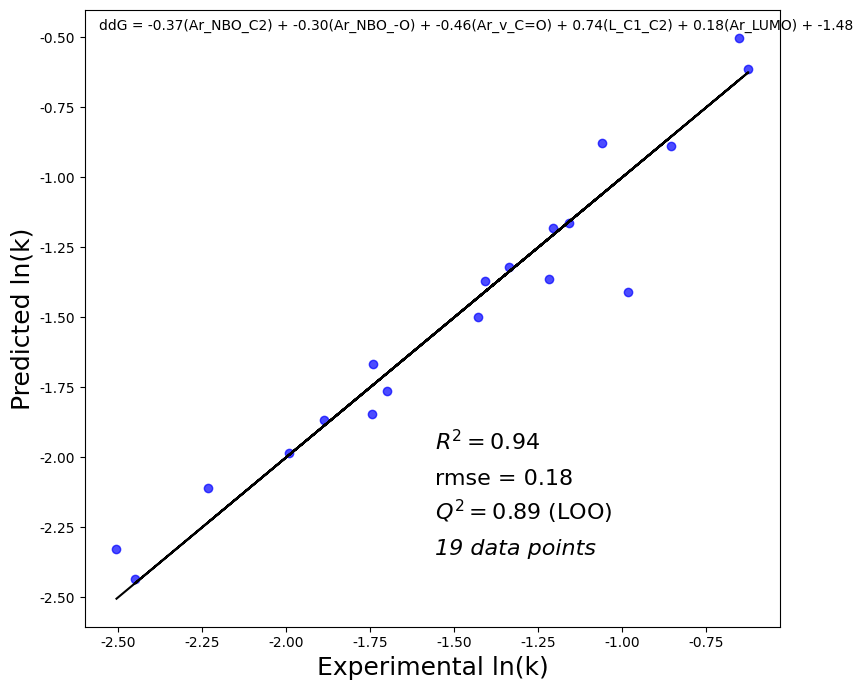

# Quantum Descriptor Regression for Indigo Aryl/Alkyl Substituents 🌈📈

This repository provides a complete pipeline to **extract quantum chemical descriptors from Gaussian log files** and **predict reactivity trends (e.g., `ln(kobs)`)** for indigo derivatives with aryl or alkyl substituents.



It combines:
- Automated quantum descriptor extraction from `.log` files
- Sterimol calculation using `morfeus-ml`
- Feature merging with Excel data
- Regression modeling with LOOCV
- A clean Jupyter walkthrough for Indigo compounds

---

## 🧠 What This Project Does

| File | Description |
|------|-------------|
| `extractor_regr.py` | Core feature extractor + regression pipeline |
| `indigo_aryl_alkyl.ipynb` | Walkthrough notebook for Indigo compounds |
| `logfiles/` | Folder of Gaussian `.log` files for each compound |
| `indigo_data.xlsx` | Excel with compound names and `ln(kobs)` |
| `final_output.xlsx` | Merged dataset with descriptors |
| `regression_search_results.csv` | All models tested + metrics |
| `Regression_Plot.png` | Best-fit regression visualization |

## ⚙️ How to Use

### 1. Install dependencies

```bash
pip install pandas numpy scikit-learn matplotlib morfeus-ml
````

The script auto-installs `morfeus-ml` if not present.

---

### 2. Prepare input files

* Store Gaussian log files in a folder like `logfiles/`
* Provide an Excel file (`indigo_data.xlsx`) with:

  * `Compound`, `Ar1`, `Ar2`, and a target column like `ln(kobs)`

---

### 3. Run the pipeline

**Option A: Python script**

```python
from extractor_regr import run_full_pipeline

run_full_pipeline(
    log_folder='logfiles',
    xlsx_path='indigo_data.xlsx',
    target='ln(kobs)',
    output_path='final_output.xlsx',
    plot_path='Regression_Plot.png',
    auto_pairing=True
)
```

#### Option 2: Jupyter Notebook

Open `indigo_aryl_alkyl.ipynb` and follow the workflow:

* Load `.xlsx` and `.log` files
* Extract all features
* Visualize and evaluate regression results

---

## 📦 Output Files

* `final_output.xlsx`: Merged features + target
* `regression_search_results.csv`: Model comparison table
* `Regression_Plot.png`: Prediction vs experiment
* `problem_index_report.xlsx`: Log files with parsing failures
* `unique_ar_features.xlsx`: Extracted per-substituent descriptors

---

## 📜 License

MIT License — feel free to modify, use, or cite.
