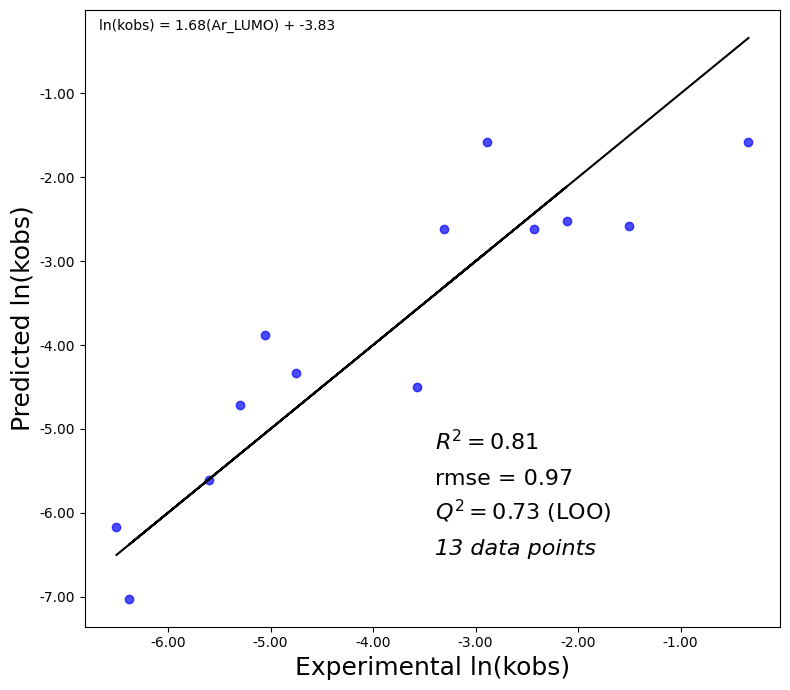

# Quantum Descriptor Regression for Diaryl Indigo Compounds 💠📈

This repository presents a complete pipeline for **predicting reactivity trends (e.g., `ln(kobs)`) in diaryl-substituted indigo compounds** using quantum chemical descriptors automatically extracted from Gaussian `.log` files.



It includes:
- Descriptor extraction (NBO, HOMO/LUMO, dipole, polarizability, vibrational)
- Sterimol parameter calculation via `morfeus-ml`
- Regression modeling with Leave-One-Out Cross-Validation (LOOCV)
- Full analysis workflow in a Jupyter notebook

---

## 🧠 What This Project Does

- Extracts descriptors from Gaussian `.log` files
- Calculates Sterimol L/B1/B5 values
- Merges descriptors with reaction data (e.g., `ln(kobs)`)
- Performs LOOCV regression to identify predictive feature sets
- Visualizes the best-performing model

## 🔧 How to Use

### 1. Install dependencies

```bash
pip install pandas numpy scikit-learn matplotlib morfeus-ml
````

> `extractor_regr.py` also supports auto-installation of `morfeus-ml`.

---

### 2. Prepare input files

* Gaussian `.log` files → place them in a folder (e.g., `logfiles/`)
* Excel file `diaryl_indigo_data.xlsx` must contain columns like:

  * `Compound`, `Ar1`, `Ar2`, `ln(kobs)`

---

### 3. Run the pipeline

#### Option 1: Script (recommended for batch mode)

```python
from extractor_regr import run_full_pipeline

run_full_pipeline(
    log_folder='logfiles',
    xlsx_path='diaryl_indigo_data.xlsx',
    target='ln(kobs)',
    output_path='final_output.xlsx',
    plot_path='Regression_Plot.png',
    auto_pairing=True
)
```

#### Option 2: Jupyter Notebook

Open `indigo_diaryl.ipynb` for an interactive walkthrough:

* Descriptor extraction per Ar group
* Merging with kinetic data
* Model selection + plotting

---

## 📦 Output Files

| File                            | Description                               |
| ------------------------------- | ----------------------------------------- |
| `final_output.xlsx`             | Cleaned dataset with all descriptors      |
| `regression_search_results.csv` | All feature combinations with metrics     |
| `Regression_Plot.png`           | Experimental vs predicted values          |
| `problem_index_report.xlsx`     | Molecules with missing data or log errors |
| `unique_ar_features.xlsx`       | Per-substituent descriptor sheet          |

---

## 📜 License

MIT License — Free to use, adapt, or cite.
